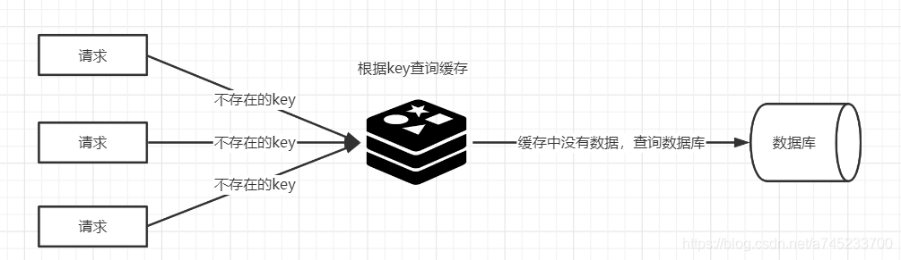
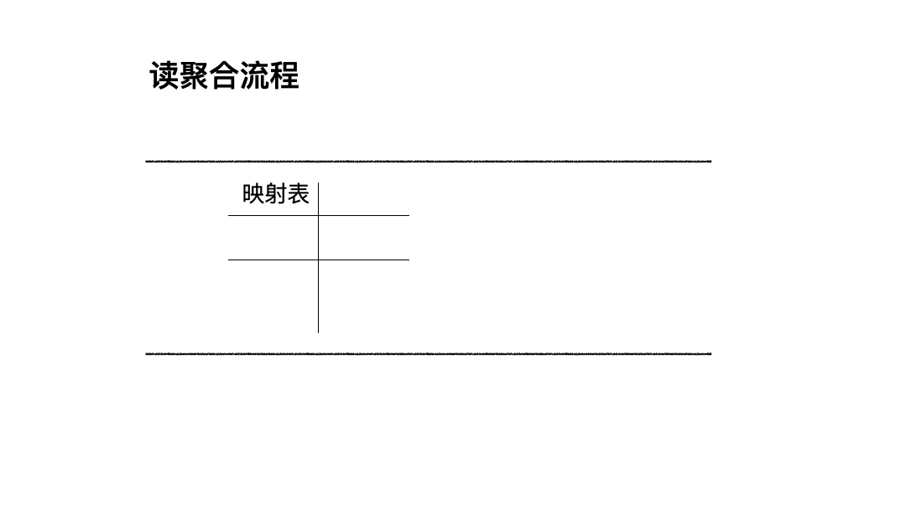

# Read request aggregation

  在读操作时，缓存优化是一种常见的优化手段。具体的做法是将读取的数据存储在内存中，并通过唯一的Key来索引这些数据。当读请求来到时，如果该Key在缓存中没有命中，那么就需要从后端存储（如MySql、PostgreSQL、TiDB）获取。用户请求直接穿透到后端存储，如果并发很大，这可能是一个很大的风险。

>缓存击穿：某个热点的key生效，大并发集中对其进行请求，就会造成大量的请求读缓存没读到数据，从而导致高并发访问数据库，引起引起数据库压力剧增。
>
>缓存穿透：用户请求的数据在缓存中不存在即没有命中，同时在数据库中也不存在，导致用户每次请求该数据都要去数据库中查询一遍。如果有恶意攻击者不断请求系统中不存在的数据，会导致短时间大量请求落在数据库上，造成数据库压力过大，甚至导致数据库承受不住而宕机崩溃。
>
>
>
>缓存雪崩：在某一个时刻出现大规模的key失效，那么就会导致大量的请求打在了数据库上面，导致数据库压力巨大，如果在高并发的情况下，可能瞬间就会导致数据库宕机。这时候如果运维马上又重启数据库，马上又会有新的流量把数据库打死。

例如，对于 Key：“test”，如果缓存中没有相应的数据，并且突然出现大量并发读取请求，每个请求都会发现缓存未命中。如果这些请求全部直接访问后端存储，可能会给后端存储带来巨大压力。

为了应对这种情况，我们其实可以只允许一个读请求去后端读取数据，而其他并发请求则等待这个请求的结果。这就是读请求聚合的基本原理。

在Go语言中，可以使用[`singleflight`](https://pkg.go.dev/golang.org/x/sync/singleflight) 这类第三方库完成上述需求。`singleflight`的设计理念是“单一请求执行”，即针对同一个Key，在多个并发请求中只允许一个请求访问后端。

```go
package main

import (
  // ...
 "golang.org/x/sync/singleflight"
)
func main() {
   var g singleflight.Group
   var wg sync.WaitGroup
    
   // 模拟多个 goroutine 并发请求相同的资源
   for i := 0; i < 5; i++ {
      wg.Add(1)
      go func(idx int) {
          defer wg.Done()
          v, err, shared := g.Do("objectkey", func() (interface{}, error) {
              fmt.Printf("协程ID:%v 正在执行...\n", idx)
              time.Sleep(2 * time.Second)
              return "objectvalue", nil
          })
          if err != nil {
              log.Fatalf("err:%v", err)
          }
          fmt.Printf("协程ID:%v 请求结果: %v, 是否共享结果: %v\n", idx, v, shared)
      }(i)
   }
   wg.Wait()
}
```

在这个例子中，多个Goroutine并发地请求Key为“objectkey”的资源。通过singleflight，我们确保只有一个Goroutine去执行实际的数据加载操作，而其他请求则等待这个操作的结果。

## **singleflight的原理**

singleflight 库提供了一个Group结构体，用于管理不同的请求，意图在内部实现聚合的效果。定义如下：

```go
type Group struct {
   mu sync.Mutex       // 互斥锁，包含下面的映射表
   m  map[string]*call // 正在执行请求的映射表
}
```

Group结构的核心就是这个map结构。每个正在执行的请求被封装在 call 结构中，定义如下：

```go
type call struct {
   wg sync.WaitGroup // 用于同步并发的请求
   val interface{}   // 用于存放执行的结果
   err error         // 存放执行的结果
   dups  int         // 用于计数聚合的请求
    // ...其他字段用于处理特殊情况和提高容错性
}
```

Group结构的Do方法实现了聚合去重的核心逻辑，代码实现如下所示：

```go
func (g *Group) Do(key string, fn func() (interface{}, error)) (v interface{}, err error, shared bool) {
   g.mu.Lock()
   if g.m == nil {
      g.m = make(map[string]*call)
   }
   // 用 map 结构，来判断是否已经有对应 Key 正在执行的请求
   if c, ok := g.m[key]; ok {
      c.dups++
      // 如果有对应 Key 的请求正在执行，那么等待结果即可。
      g.mu.Unlock()
      c.wg.Wait()
      // ...
      return c.val, c.err, true
   }
   // 创建一个代表执行请求的结构，和 Key 关联起来，存入map中
   c := new(call)
   c.wg.Add(1)
   g.m[key] = c
   g.mu.Unlock()
   g.doCall(c, key, fn) // 真正执行请求
   return c.val, c.err, c.dups > 0
}

func (g *Group) doCall(c *call, key string, fn func() (interface{}, error)) {
    defer func() {
      // ...省略异常处理
      c.wg.Done()
    }()
    func() {
        // 真正执行请求
         c.val, c.err = fn()
    }()
    // ...
}
```

通过上述代码，singleflight的Group结构体利用map记录了正在执行的请求，关联了请求的Key和执行体。当新的请求到来时，先检查是否有相同Key的正在执行的请求，如果有，则等待起结果，从而避免重复执行相同的请求。



## 总结

> 核心是一个 map，只要有相同Key的读取正在执行，那么等待这份正在执行的请求的结果也是符合预期的。同步等待则用的是 sync.WaitGroup 来实现。