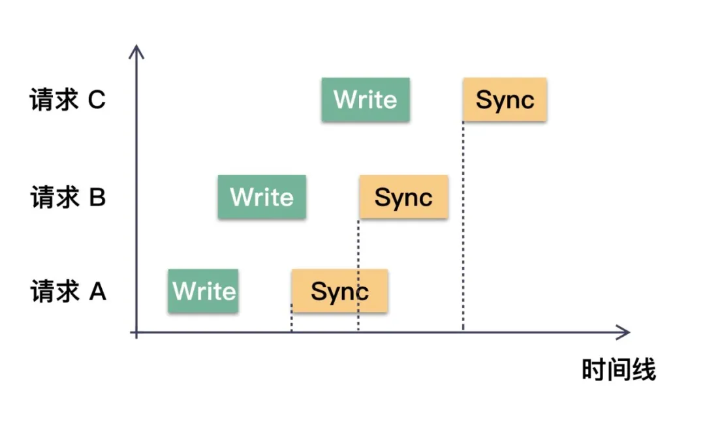

# Write request aggregation

在写操作中，首先通过Write系统调用来写入数据，默认情况下此时数据可能仅驻留在`PageCache`中，为了确保数据安全落盘，此时我们需要手动调用一次 Sync 系统调用。

然而，Sync操作的成本相当大，并且它除了数据，还会同步元数据等其他信息到磁盘上。对于性能影响巨大。并且，在机械盘的场景下，串行化的执行Sync是更好的实践。

因此，我们面临的一个问题是：如果在不牺牲数据安全性的前提下，能否减少Sync的次数呢？

对于同一个文件的写操作，合并Sync操作是可行的。

**文件的Sync会将当前时刻文件在内存中的全部数据一次性同步到磁盘。无论之前执行过多少次Write调用，一次Sync就能全部刷盘。这正是聚合写请求以优化性能的关键所在。**

## **写聚合的原理**

假设对同一个文件写了三次数据，每一次都是Write+Sync的操作。那么在合适的时机，三次Sync调用可以优化成一次。如下图所示：



请求 C 的 Sync 操作是在所有请求的 Write 之后才发起的，所以它必定能保证在此之前的所有变更的数据都安全落盘。这就是写操作聚合的根本原理。

**读写聚合优化感觉有一点相似？那能否用 `singleflight` 聚合写操作呢？**

例如，当并发调用 Sync 的时候，如果发现有正在执行的Sync，能否共享这次Sync请求呢？

**不可以。使用`singleflight`来优化写无法保证数据的安全性。**

我们必须要保证的是，Sync操作一定要在Write完成之后发起。只要两者存在并发的可能性，那么Sync就不能保证携带了这次Write操作的数据，也就无法保证安全性。

当请求 B 完成 Write 操作后，看到请求 A 已经发起了 Sync 操作。此时它是无法判断请求 A 的 Sync 操作是否包含了请求 B 的数据。从图示我们也很清晰的看到，请求B的 Write 和请求 A 的 Sync 在时间上存在重叠。

因此，当Write完成后，如果发现有一个Sync正在执行，我们不能简单地复用这个Sync。我们需要启动一个新的Sync操作。

**那么聚合的时机在哪里呢？**

对于读请求的聚合，其时机相对直观：一旦发现有针对同一个 Key 的请求，就可以等待这次的结果并复用该结果。但写请求的聚合时机则不是，它的聚合时机是在等待中遇到“志同道合“的请求。

让我们通过一个具体例子来说明（注意，以下所有的请求都是针对相同的文件）：

1. t0 时刻：A 执行了 Write，并尝试发起Sync，由于此时没有其他请求在执行，A 便执行真正的Sync操作。
2. t1 时刻：B 执行了 Write，发现已经有请求在Sync了（即A），因此进入等待状态，直到A完成。
3. t2 时刻：C 执行了 Write，发现已经有请求在Sync了（即A），因此进入等待状态，直到A完成。
4. t3 时刻：D 执行了 Write，发现已经有请求在Sync了（即A），因此进入等待状态，直到A完成。
5. t4 时刻：A 的Sync操作终于完成。A随即通知 B、C、D 三位，告知它们可以进行Sync请求了。
6. t5 时刻：**从B、C、D中选择一个来执行一次Sync操作。假设B被选中，则C、D请求则等待B完成Sync即可。B发起的Sync操作一定包含了B，C，D三者写的数据，确保了安全性。**
7. t6：B 的Sync操作完成，C、D被通知操作已完成。如此一来，B、C、D三者的数据都确保落盘。

正如上述所演示，写操作的聚合是在等待前一次Sync操作完成期间收集到的请求。本来需要4次Sync操作，现在仅需2次Sync就可以确保数据的安全性。

在高并发的场景下，这种聚合方式的效益尤为显著。

## **写聚合的代码实现**

实现写操作聚合的关键在于确保数据安全的时序前提下进行聚合。以下是一种典型和实现方式，它是对 `sync.Cond` 和 `sync.Once` 的巧妙应用。首先，我们定义一个负责聚合的结构体。

```go
// SyncJob 用于管理一个文件的 Sync 任务
type SyncJob struct {
   *sync.Cond                         // 聚合 Sync 的关键
   holding    int32                   // 记录聚合的个数
   lastErr    error                   // 记录执行 Sync 结果
   syncPoint  *sync.Once              // 确保同一时间只有一个 Sync 执行
   syncFunc   func(interface{}) error // 实际执行 Sync 的函数
}

// SyncJob 的构建函数
func NewSyncJob(fn func(interface{}) error) *SyncJob {
   return &SyncJob{
      Cond:      sync.NewCond(&sync.Mutex{}),
      syncFunc:  fn,
      syncPoint: &sync.Once{},
   }
}

func (s *SyncJob) Do(job interface{}) error {
 s.L.Lock()
 if s.holding > 0 {
  // 如果有请求在前面，则等待前一次请求完成。
    // 等待的过程中，会有"志同道合"之人
  s.Wait()
 }
 // 准备要下发请求了，增加计数
 s.holding += 1
 syncPoint := s.syncPoint
 s.L.Unlock()

 // "志同道合"的人一起来到这里，此时已经满足 Write 和 Sync 的时序关系。
  // 使用 sync.Once 确保只有请求者执行同步操作。
 syncPoint.Do(func() {
  // 执行实际的 Sync 操作
  s.lastErr = s.syncFunc(job)

  s.L.Lock()
    // holding 展示本批次有多少个请求
    fmt.Printf("holding:%v\n", s.holding)
  // 本次请求执行完成，重置计数器，准备下一轮聚合
  s.holding = 0
  s.syncPoint = &sync.Once{}
  // 唤醒下一批的请求
  s.Broadcast()
  s.L.Unlock()
 })
 return s.lastErr
}
```

在这里，我们使用了一个Go的 `sync.Cond` 来阻塞和通知等待中的请求，并通过 sync.Once 确保同步操作同一时间、同一批只有一个在执行。

- 其实在这个场景下，从代码实现来讲，`sync.Cond` 也可以使用 Go 的 Channel 来实现相同的效果，用 Ch← 来阻塞，用 close(Ch) 来通知。

```go
func main() {
 file, err := os.OpenFile("hello.txt", os.O_RDWR, 0700)
 if err != nil {
  log.Fatal(err)
 }
 defer file.Close()

 // 初始化 Sync 聚合服务
 syncJob := NewSyncJob(func(interface{}) error {
  fmt.Printf("do sync...\n")
    time.Sleep(time.Second())
  return file.Sync()
 })

 wg := sync.WaitGroup{}
 for i := 0; i < 10; i++ {
  wg.Add(1)
  go func() {
   defer wg.Done()
   // 执行写操作 write ...
   fmt.Printf("write...\n")
   // 触发 sync 操作
   syncJob.Do(file)
  }()
 }
 wg.Wait()
}
```

通过上述代码，我们讲对文件写入操作后的 Sync 调用进行有效的聚合。童鞋们可以多次运行程序，观察其行为。可以通过观察打印的 holding 字段获悉每一批聚合的请求是多少个。

> 上面的代码无论怎么跑，最少要执行两次 Sync

`syncJob.Do(file)` 被每个 goroutine 在循环中调用。这里的关键在于 `SyncJob` 结构体内的 `sync.Once` 字段。`sync.Once` 是一个同步原语，确保无论多少次调用，其内的函数只会被执行一次。在 `SyncJob.Do` 方法中，`syncPoint` 字段是 `sync.Once` 类型，且在每次同步执行之后将其重新初始化为一个新的 `sync.Once` 实例。

现在，让我们来考虑为何至少会有两次 Sync 被执行：

1. 当第一个 goroutine 进入 `SyncJob.Do` 方法，并在`syncPoint.Do` 之前加锁时，其余 goroutines 会进入等待状态，因为 `s.holding`会增加。

2. 第一个 goroutine 会执行 Sync 操作，并在完成时调用 Broadcast() 来唤醒等待中的 goroutines。

3. 由于 `sync.Once` 进行了重置 (`s.syncPoint = &sync.Once{}`)，下一个进入 `syncPoint.Do` 的 goroutine 会触发新的一次 Sync 操作。

问题出在，由于` s.syncPoint` 在第一次 Sync 完成后重置，任何等待的 goroutine 都会认为它是首次进入 `syncPoint.Do`，因此在它们各自通过这个点的时候都会触发 Sync。虽然 sync.Once 确保在一次聚合中只有一个 Sync 执行，但由于重置操作，新的聚合会开始，并且至少有一个 goroutine 将在新的聚合中执行 Sync。

因此，如果您在测试时启动了多于一个的 goroutine，至少会有两次 Sync 调用：第一次是最开始的 `syncPoint.Do` 调用，而至少有一次是后面的 goroutine 在`s.syncPoint` 被重置之后的 syncPoint.Do 中调用。如果有多于1个的 goroutines 在第一次 Sync 被执行（即持有锁）之前启动，那么每个后续的 goroutine 都会在它们各自的 syncPoint.Do 中触发新的 Sync，从而导致超过两次的执行。

为了确保只执行一次 Sync 操作，您可能需要重新设计 `SyncJob` 结构和 Do 方法，以便在所有的写操作完成之后，只进行一次同步操作。这可能需要一个额外的同步原语，比如Barrier，来确保所有 goroutines 的写入操作完成后只调用一次 Sync。


## 总结

写操作，核心是要先保证数据安全性。它必须保证 Sync 操作在 Write 操作之后。因此当发现有正在执行的Sync操作，那么就等待这次完成，然后必须重新开启一轮的 Sync 操作，等待的过程也是聚合的时机。我们可以使用 sync.Cond（或者 Channel ）来实现阻塞和唤醒，使用 sync.Once 来保证同一时间单个执行。
