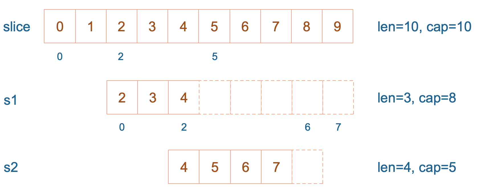

# Slice

## 数组和切片有什么异同

slice 的底层数据是数组，slice 是对数组的封装，它描述一个数组的片段。两者都可以通过下标来访问单个元素。

数组是定长的，长度定义好之后，不能再更改。在 Go 中，数组是不常见的，因为其长度是类型的一部分，限制了它的表达能力，比如 [3]int 和 [4]int 就是不同的类型。

而切片则非常灵活，它可以动态地扩容。切片的类型和长度无关。

数组就是一片连续的内存， slice 实际上是一个结构体，包含三个字段：长度、容量、底层数组。

```golang
// runtime/slice.go
type slice struct {
    array unsafe.Pointer // 元素指针
    len   int // 长度 
    cap   int // 容量
}
```

slice 的数据结构如下：


注意，底层数组是可以被多个 slice 同时指向的，因此对一个 slice 的元素进行操作是有可能影响到其他 slice 的。

【引申1】 [3]int 和 [4]int 是同一个类型吗？

不是。因为数组的长度是类型的一部分，这是与 slice 不同的一点。

【引申2】 下面的代码输出是什么？

说明：例子来自雨痕大佬《Go学习笔记》第四版，P43页。这里我会进行扩展，并会作图详细分析。

```golang
package main

import "fmt"

func main() {
    slice := []int{0, 1, 2, 3, 4, 5, 6, 7, 8, 9}
    s1 := slice[2:5]
    s2 := s1[2:6:7]

    s2 = append(s2, 100)
    s2 = append(s2, 200)

    s1[2] = 20

    fmt.Println(s1)
    fmt.Println(s2)
    fmt.Println(slice)
}
```

结果：

```shell
[2 3 20]
[4 5 6 7 100 200]
[0 1 2 3 20 5 6 7 100 9]
```

`s1` 从 `slice` 索引2（闭区间）到索引5（开区间，元素真正取到索引4），长度为3，容量默认到数组结尾，为8。 `s2` 从 `s1` 的索引2（闭区间）到索引6（开区间，元素真正取到索引5），容量到索引7（开区间，真正到索引6），为5。



接着，向 `s2` 尾部追加一个元素 100：

```golang
s2 = append(s2, 100)
```

`s2` 容量刚好够，直接追加。不过，这会修改原始数组对应位置的元素。这一改动，数组和 `s1` 都可以看得到。


再次向 `s2` 追加元素200：

```golang
s2 = append(s2, 100)
```

这时，`s2` 的容量不够用，该扩容了。于是，`s2` 另起炉灶，将原来的元素复制新的位置，扩大自己的容量。并且为了应对未来可能的 `append` 带来的再一次扩容，`s2` 会在此次扩容的时候多留一些 `buffer`，将新的容量将扩大为原始容量的2倍，也就是10了。


最后，修改 `s1` 索引为2位置的元素：

```golang
s1[2] = 20
```

这次只会影响原始数组相应位置的元素。它影响不到 `s2` 了，人家已经远走高飞了。

![s1[2]=20](./assets/4.png)

再提一点，打印 `s1` 的时候，只会打印出 `s1` 长度以内的元素。所以，只会打印出3个元素，虽然它的底层数组不止3个元素。

## 切片的容量是怎样增长的

一般都是在向 slice 追加了元素之后，才会引起扩容。追加元素调用的是 `append` 函数。

先来看看 `append` 函数的原型：

```golang
func append(slice []Type, elems ...Type) []Type
```

append 函数的参数长度可变，因此可以追加多个值到 slice 中，还可以用 `...` 传入 slice，直接追加一个切片。

```golang
slice = append(slice, elem1, elem2)
slice = append(slice, anotherSlice...)
```

`append`函数返回值是一个新的slice，Go编译器不允许调用了 append 函数后不使用返回值。

```golang
append(slice, elem1, elem2)
append(slice, anotherSlice...)
```

所以上面的用法是错的，不能编译通过。

使用 append 可以向 slice 追加元素，实际上是往底层数组添加元素。但是底层数组的长度是固定的，如果索引 `len-1` 所指向的元素已经是底层数组的最后一个元素，就没法再添加了。

这时，slice 会迁移到新的内存位置，新底层数组的长度也会增加，这样就可以放置新增的元素。同时，为了应对未来可能再次发生的 append 操作，新的底层数组的长度，也就是新 `slice` 的容量是留了一定的 `buffer` 的。否则，每次添加元素的时候，都会发生迁移，成本太高。

新 slice 预留的 `buffer` 大小是有一定规律的。在golang1.18版本更新之前网上大多数的文章都是这样描述slice的扩容策略的：

>当原 slice 容量小于 `1024` 的时候，新 slice 容量变成原来的 `2` 倍；原 slice 容量超过 `1024`，新 slice 容量变成原来的`1.25`倍。

在1.18版本更新之后，slice的扩容策略变为了：

> 当原slice容量(oldcap)小于256的时候，新slice(newcap)容量为原来的2倍；原slice容量超过256，新slice容量newcap = oldcap+(oldcap+3*256)/4

为了说明上面的规律，我写了一小段玩具代码：

```golang
package main

import "fmt"

func main() {
	s := make([]int, 0)

	oldCap := cap(s)

	for i := 0; i < 2048; i++ {
		s = append(s, i)

		newCap := cap(s)

		if newCap != oldCap {
			fmt.Printf("[%d -> %4d] cap = %-4d  |  after append %-4d  cap = %-4d\n", 0, i-1, oldCap, i, newCap)
			oldCap = newCap
		}
	}
}
```

我先创建了一个空的 `slice`，然后，在一个循环里不断往里面 `append` 新的元素。然后记录容量的变化，并且每当容量发生变化的时候，记录下老的容量，以及添加完元素之后的容量，同时记下此时 `slice` 里的元素。这样，我就可以观察，新老 `slice` 的容量变化情况，从而找出规律。

运行结果(1.18版本之前)：

```shell
[0 ->   -1] cap = 0     |  after append 0     cap = 1   
[0 ->    0] cap = 1     |  after append 1     cap = 2   
[0 ->    1] cap = 2     |  after append 2     cap = 4   
[0 ->    3] cap = 4     |  after append 4     cap = 8   
[0 ->    7] cap = 8     |  after append 8     cap = 16  
[0 ->   15] cap = 16    |  after append 16    cap = 32  
[0 ->   31] cap = 32    |  after append 32    cap = 64  
[0 ->   63] cap = 64    |  after append 64    cap = 128 
[0 ->  127] cap = 128   |  after append 128   cap = 256 
[0 ->  255] cap = 256   |  after append 256   cap = 512 
[0 ->  511] cap = 512   |  after append 512   cap = 1024
[0 -> 1023] cap = 1024  |  after append 1024  cap = 1280
[0 -> 1279] cap = 1280  |  after append 1280  cap = 1696
[0 -> 1695] cap = 1696  |  after append 1696  cap = 2304
```

运行结果(1.18版本)：

```shell
[0 ->   -1] cap = 0     |  after append 0     cap = 1
[0 ->    0] cap = 1     |  after append 1     cap = 2   
[0 ->    1] cap = 2     |  after append 2     cap = 4   
[0 ->    3] cap = 4     |  after append 4     cap = 8   
[0 ->    7] cap = 8     |  after append 8     cap = 16  
[0 ->   15] cap = 16    |  after append 16    cap = 32  
[0 ->   31] cap = 32    |  after append 32    cap = 64  
[0 ->   63] cap = 64    |  after append 64    cap = 128 
[0 ->  127] cap = 128   |  after append 128   cap = 256 
[0 ->  255] cap = 256   |  after append 256   cap = 512 
[0 ->  511] cap = 512   |  after append 512   cap = 848 
[0 ->  847] cap = 848   |  after append 848   cap = 1280
[0 -> 1279] cap = 1280  |  after append 1280  cap = 1792
[0 -> 1791] cap = 1792  |  after append 1792  cap = 2560
```

根据上面的结果我们可以看出在`1.18`版本之前：

在原来的slice容量`oldcap`小于1024的时候，新 slice 的容量`newcap`的确是`oldcap`的2倍。

但是，当`oldcap`大于等于 `1024` 的时候，情况就有变化了。当向 slice 中添加元素 `1280` 的时候，原来的slice 的容量为 `1280`，之后`newcap`变成了 `1696`，两者并不是 `1.25` 倍的关系（1696/1280=1.325）。添加完 `1696` 后，新的容量 `2304` 当然也不是 `1696` 的 `1.25` 倍。

在`1.18`版本之后：

在原来的slice 容量`oldcap`小于256的时候，新 slice 的容量`newcap`的确是`oldcap` 的2倍。

但是，当`oldcap`容量大于等于 `256` 的时候，情况就有变化了。当向 slice 中添加元素 `512` 的时候，老 slice 的容量为 `512`，之后变成了 `8`48，两者并没有符合`newcap = oldcap+(oldcap+3*256)/4` 的策略（512+（512+3*256）/4）=832。添加完 `848` 后，新的容量 `1280` 当然也不是 按照之前策略所计算出的的1252。

难道现在网上各种文章中的扩容策略并不是正确的吗。我们直接搬出源码：源码面前，了无秘密。

从前面汇编代码我们也看到了，向 slice 追加元素的时候，若容量不够，会调用 `growslice` 函数，所以我们直接看它的代码。

**golang版本1.9.5**

```golang
// go 1.9.5 src/runtime/slice.go:82
func growslice(et *_type, old slice, cap int) slice {
    // ……
    newcap := old.cap
	doublecap := newcap + newcap
	if cap > doublecap {
		newcap = cap
	} else {
		if old.len < 1024 {
			newcap = doublecap
		} else {
			for newcap < cap {
				newcap += newcap / 4
			}
		}
	}
	// ……
	
	capmem = roundupsize(uintptr(newcap) * ptrSize)
	newcap = int(capmem / ptrSize)
}
```

**golang版本1.18**

```golang
// go 1.18 src/runtime/slice.go:178
func growslice(et *_type, old slice, cap int) slice {
    // ……
    newcap := old.cap
	doublecap := newcap + newcap
	if cap > doublecap {
		newcap = cap
	} else {
		const threshold = 256
		if old.cap < threshold {
			newcap = doublecap
		} else {
			for 0 < newcap && newcap < cap {
                // Transition from growing 2x for small slices
				// to growing 1.25x for large slices. This formula
				// gives a smooth-ish transition between the two.
				newcap += (newcap + 3*threshold) / 4
			}
			if newcap <= 0 {
				newcap = cap
			}
		}
	}
	// ……
    
	capmem = roundupsize(uintptr(newcap) * ptrSize)
	newcap = int(capmem / ptrSize)
}
```

看到了吗？如果只看前半部分，现在网上各种文章里说的 `newcap` 的规律是对的。现实是，后半部分还对 `newcap` 作了一个`内存对齐`，这个和内存分配策略相关。进行内存对齐之后，新 slice 的容量是要 `大于等于` 按照前半部分生成的`newcap`。

之后，向 Go 内存管理器申请内存，将老 slice 中的数据复制过去，并且将 append 的元素添加到新的底层数组中。

最后，向 `growslice` 函数调用者返回一个新的 slice，这个 slice 的长度并没有变化，而容量却增大了。

【引申1】

来看一个例子，来源于[这里](https://jiajunhuang.com/articles/2017_07_18-golang_slice.md.html)

```golang
package main

import "fmt"

func main() {
    s := []int{5}
    s = append(s, 7)
    s = append(s, 9)
    x := append(s, 11)
    y := append(s, 12)
    fmt.Println(s, x, y)
}
```

| 代码               | 切片对应状态                                                 |
| ------------------ | ------------------------------------------------------------ |
| s := []int{5}      | s 只有一个元素，`[5]`                                        |
| s = append(s, 7)   | s 扩容，容量变为2，`[5, 7]`                                  |
| s = append(s, 9)   | s 扩容，容量变为4，`[5, 7, 9]`。注意，这时 s 长度是3，只有3个元素 |
| x := append(s, 11) | 由于 s 的底层数组仍然有空间，因此并不会扩容。这样，底层数组就变成了 `[5, 7, 9, 11]`。注意，此时 s = `[5, 7, 9]`，容量为4；x = `[5, 7, 9, 11]`，容量为4。这里 s 不变 |
| y := append(s, 12) | 这里还是在 s 元素的尾部追加元素，由于 s 的长度为3，容量为4，所以直接在底层数组索引为3的地方填上12。结果：s = `[5, 7, 9]`，y = `[5, 7, 9, 12]`，x = `[5, 7, 9, 12]`，x，y 的长度均为4，容量也均为4 |

所以最后程序的执行结果是：

```shell
[5 7 9] [5 7 9 12] [5 7 9 12]
```

这里要注意的是，append函数执行完后，返回的是一个全新的 slice，并且对传入的 slice 并不影响。

【引申2】

关于 `append`，我们最后来看一个例子，来源于 [Golang Slice的扩容规则](https://jodezer.github.io/2017/05/golangSlice%E7%9A%84%E6%89%A9%E5%AE%B9%E8%A7%84%E5%88%99)。

```golang
package main

import "fmt"

func main() {
	s := []int{1,2}
	s = append(s,4,5,6)
	fmt.Printf("len=%d, cap=%d",len(s),cap(s))
}
```

运行结果是：

```shell
len=5, cap=6
```

如果按网上各种文章中总结的那样：小于原 slice 长度小于 1024 的时候，容量每次增加 1 倍。添加元素 4 的时候，容量变为4；添加元素 5 的时候不变；添加元素 6 的时候容量增加 1 倍，变成 8。

那上面代码的运行结果就是：

```shell
len=5, cap=8
```

这是错误的！我们来仔细看看，为什么会这样，再次搬出代码：

```golang
// go 1.9.5 src/runtime/slice.go:82
func growslice(et *_type, old slice, cap int) slice {
    // ……
    newcap := old.cap
	doublecap := newcap + newcap
	if cap > doublecap {
		newcap = cap
	} else {
		// ……
	}
	// ……
	
	capmem = roundupsize(uintptr(newcap) * ptrSize)
	newcap = int(capmem / ptrSize)
}
```

这个函数的参数依次是 `元素的类型，老的 slice，新 slice 最小求的容量`。

例子中 `s` 原来只有 2 个元素，`len` 和 `cap` 都为 2，`append` 了三个元素后，长度变为 5，容量最小要变成 5，即调用 `growslice` 函数时，传入的第三个参数应该为 5。即 `cap=5`。而一方面，`doublecap` 是原 `slice`容量的 2 倍，等于 4。满足第一个 `if` 条件，所以 `newcap` 变成了 5。

接着调用了 `roundupsize` 函数，传入 40。（代码中ptrSize是指一个指针的大小，在64位机上是8）

我们再看内存对齐，搬出 `roundupsize` 函数的代码：

```golang
// src/runtime/msize.go:13
func roundupsize(size uintptr) uintptr {
	if size < _MaxSmallSize {
		if size <= smallSizeMax-8 {
			return uintptr(class_to_size[size_to_class8[(size+smallSizeDiv-1)/smallSizeDiv]])
		} else {
			//……
		}
	}
    //……
}

const _MaxSmallSize = 32768
const smallSizeMax = 1024
const smallSizeDiv = 8
```

很明显，我们最终将返回这个式子的结果：

```golang
class_to_size[size_to_class8[(size+smallSizeDiv-1)/smallSizeDiv]]
```

这是 `Go` 源码中有关内存分配的两个 `slice`。`class_to_size`通过 `spanClass`获取 `span`划分的 `object`大小。而 `size_to_class8` 表示通过 `size` 获取它的 `spanClass`。

```golang
var size_to_class8 = [smallSizeMax/smallSizeDiv + 1]uint8{0, 1, 2, 3, 4, 5, 5, 6, 6, 7, 7, 8, 8, 9, 9, 10, 10, 11, 11, 12, 12, 13, 13, 14, 14, 15, 15, 16, 16, 17, 17, 18, 18, 19, 19, 19, 19, 20, 20, 20, 20, 21, 21, 21, 21, 22, 22, 22, 22, 23, 23, 23, 23, 24, 24, 24, 24, 25, 25, 25, 25, 26, 26, 26, 26, 27, 27, 27, 27, 27, 27, 27, 27, 28, 28, 28, 28, 28, 28, 28, 28, 29, 29, 29, 29, 29, 29, 29, 29, 30, 30, 30, 30, 30, 30, 30, 30, 31, 31, 31, 31, 31, 31, 31, 31, 31, 31, 31, 31, 31, 31, 31, 31, 32, 32, 32, 32, 32, 32, 32, 32, 32, 32, 32, 32, 32, 32, 32, 32}

var class_to_size = [_NumSizeClasses]uint16{0, 8, 16, 24, 32, 48, 64, 80, 96, 112, 128, 144, 160, 176, 192, 208, 224, 240, 256, 288, 320, 352, 384, 416, 448, 480, 512, 576, 640, 704, 768, 896, 1024, 1152, 1280, 1408, 1536, 1792, 2048, 2304, 2688, 3072, 3200, 3456, 4096, 4864, 5376, 6144, 6528, 6784, 6912, 8192, 9472, 9728, 10240, 10880, 12288, 13568, 14336, 16384, 18432, 19072, 20480, 21760, 24576, 27264, 28672, 32768}
```

我们传进去的 `size` 等于 40。所以 `(size+smallSizeDiv-1)/smallSizeDiv = 5`；获取 `size_to_class8` 数组中索引为 `5` 的元素为 `5`；获取 `class_to_size` 中索引为 `5` 的元素为 `48`。

最终，新的 slice 的容量为 `6`：

```golang
newcap = int(capmem / ptrSize) // 6
```

至于，上面的两个`魔法数组`的由来，就不展开了。

【引申2】
向一个nil的slice添加元素会发生什么？为什么？

其实 `nil slice` 或者 `empty slice` 都是可以通过调用 append 函数来获得底层数组的扩容。最终都是调用 `mallocgc` 来向 Go 的内存管理器申请到一块内存，然后再赋给原来的`nil slice` 或 `empty slice`，然后摇身一变，成为“真正”的 `slice` 了。

## 切片作为函数参数

前面我们说到，slice 其实是一个结构体，包含了三个成员：len, cap, array。分别表示切片长度，容量，底层数据的地址。

当 slice 作为函数参数时，就是一个普通的结构体。其实很好理解：若直接传 slice，在调用者看来，实参 slice 并不会被函数中的操作改变；若传的是 slice 的指针，在调用者看来，是会被改变原 slice 的。

值得注意的是，不管传的是 slice 还是 slice 指针，如果改变了 slice 底层数组的数据，会反应到实参 slice 的底层数据。为什么能改变底层数组的数据？很好理解：底层数据在 slice 结构体里是一个指针，尽管 slice 结构体自身不会被改变，也就是说底层数据地址不会被改变。 但是通过指向底层数据的指针，可以改变切片的底层数据，没有问题。

通过 slice 的 array 字段就可以拿到数组的地址。在代码里，是直接通过类似 `s[i]=10` 这种操作改变 slice 底层数组元素值。

另外，值得注意的是，Go 语言的函数参数传递，只有值传递，没有引用传递。

来看一个代码片段：

```golang
package main

func main() {
	s := []int{1, 1, 1}
	f(s)
	fmt.Println(s)
}

func f(s []int) {
	// i只是一个副本，不能改变s中元素的值
	/*for _, i := range s {
		i++
	}
	*/

	for i := range s {
		s[i] += 1
	}
}
```

运行一下，程序输出：

```shell
[2 2 2]
```

果真改变了原始 slice 的底层数据。这里传递的是一个 slice 的副本，在 `f` 函数中，`s` 只是 `main` 函数中 `s` 的一个拷贝。在`f` 函数内部，对 `s` 的作用并不会改变外层 `main` 函数的 `s`。

要想真的改变外层 `slice`，只有将返回的新的 slice 赋值到原始 slice，或者向函数传递一个指向 slice 的指针。我们再来看一个例子：

```golang
package main

import "fmt"

func myAppend(s []int) []int {
	// 这里 s 虽然改变了，但并不会影响外层函数的 s
	s = append(s, 100)
	return s
}

func myAppendPtr(s *[]int) {
	// 会改变外层 s 本身
	*s = append(*s, 100)
	return
}

func main() {
	s := []int{1, 1, 1}
	newS := myAppend(s)

	fmt.Println(s)
	fmt.Println(newS)

	s = newS

	myAppendPtr(&s)
	fmt.Println(s)
}
```

运行结果：

```shell
[1 1 1]
[1 1 1 100]
[1 1 1 100 100]
```

`myAppend` 函数里，虽然改变了 `s`，但它只是一个值传递，并不会影响外层的 `s`，因此第一行打印出来的结果仍然是 `[1 1 1]`。

而 `newS` 是一个新的 `slice`，它是基于 `s` 得到的。因此它打印的是追加了一个 `100` 之后的结果： `[1 1 1 100]`。

最后，将 `newS` 赋值给了 `s`，`s` 这时才真正变成了一个新的slice。之后，再给 `myAppendPtr` 函数传入一个 `s  指针`，这回它真的被改变了：`[1 1 1 100 100]`。
